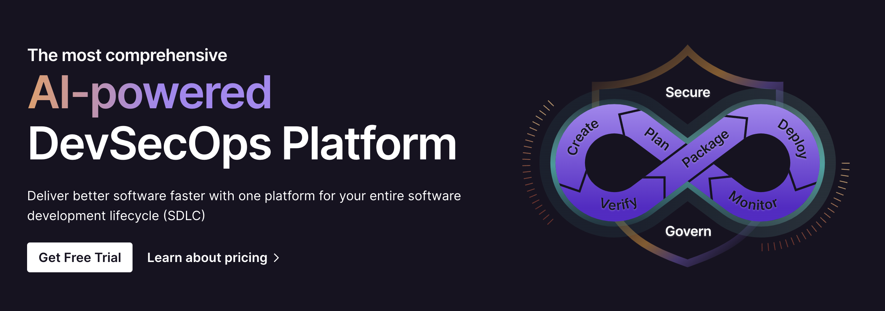

<div align="left">

[](https://gitlab.com)

# [Gitlab](https://gitlab.com)<a id="gitlab"></a>

An OpenAPI definition for the GitLab REST API.
Few API resources or endpoints are currently included.
The intent is to expand this to match the entire Markdown documentation of the API:
<https://docs.gitlab.com/ee/api/>. Contributions are welcome.

When viewing this on gitlab.com, you can test API calls directly from the browser
against the `gitlab.com` instance, if you are logged in.
The feature uses the current [GitLab session cookie](https://docs.gitlab.com/ee/api/index.html#session-cookie),
so each request is made using your account.

Instructions for using this tool can be found in [Interactive API Documentation](https://docs.gitlab.com/ee/api/openapi/openapi_interactive.html)


</div>

## Table of Contents<a id="table-of-contents"></a>

<!-- toc -->

- [Installation](#installation)
- [Getting Started](#getting-started)
- [Reference](#reference)
  * [`gitlab.accessRequests.approveForUser`](#gitlabaccessrequestsapproveforuser)
  * [`gitlab.accessRequests.approveForUser_0`](#gitlabaccessrequestsapproveforuser_0)
  * [`gitlab.accessRequests.denyAccessToUser`](#gitlabaccessrequestsdenyaccesstouser)
  * [`gitlab.accessRequests.denyAccessToUser_0`](#gitlabaccessrequestsdenyaccesstouser_0)
  * [`gitlab.accessRequests.getList`](#gitlabaccessrequestsgetlist)
  * [`gitlab.accessRequests.getList_0`](#gitlabaccessrequestsgetlist_0)
  * [`gitlab.accessRequests.requestAccessToGroup`](#gitlabaccessrequestsrequestaccesstogroup)
  * [`gitlab.accessRequests.requestAccessToProject`](#gitlabaccessrequestsrequestaccesstoproject)
  * [`gitlab.admin.getDictionaryDetails`](#gitlabadmingetdictionarydetails)
  * [`gitlab.alertManagement.authorizeMetricImageUpload`](#gitlabalertmanagementauthorizemetricimageupload)
  * [`gitlab.alertManagement.getMetricImagesForAlert`](#gitlabalertmanagementgetmetricimagesforalert)
  * [`gitlab.alertManagement.removeMetricImage`](#gitlabalertmanagementremovemetricimage)
  * [`gitlab.alertManagement.updateMetricImage`](#gitlabalertmanagementupdatemetricimage)
  * [`gitlab.alertManagement.uploadMetricImage`](#gitlabalertmanagementuploadmetricimage)
  * [`gitlab.application.getCurrentAppearance`](#gitlabapplicationgetcurrentappearance)
  * [`gitlab.application.modifyAppearance`](#gitlabapplicationmodifyappearance)
  * [`gitlab.applications.createNewApplication`](#gitlabapplicationscreatenewapplication)
  * [`gitlab.applications.deleteSpecificApplication`](#gitlabapplicationsdeletespecificapplication)
  * [`gitlab.applications.listAllRegistered`](#gitlabapplicationslistallregistered)
  * [`gitlab.avatar.getUrlForUser`](#gitlabavatargeturlforuser)
  * [`gitlab.badges.addBadgeToGroup`](#gitlabbadgesaddbadgetogroup)
  * [`gitlab.badges.addProjectBadge`](#gitlabbadgesaddprojectbadge)
  * [`gitlab.badges.getGroupBadge`](#gitlabbadgesgetgroupbadge)
  * [`gitlab.badges.getList`](#gitlabbadgesgetlist)
  * [`gitlab.badges.getProjectBadge`](#gitlabbadgesgetprojectbadge)
  * [`gitlab.badges.listViewableByAuthenticatedUser`](#gitlabbadgeslistviewablebyauthenticateduser)
  * [`gitlab.badges.previewBadgeFromGroup`](#gitlabbadgespreviewbadgefromgroup)
  * [`gitlab.badges.removeFromGroup`](#gitlabbadgesremovefromgroup)
  * [`gitlab.badges.removeFromProject`](#gitlabbadgesremovefromproject)
  * [`gitlab.badges.renderPreviewFromProject`](#gitlabbadgesrenderpreviewfromproject)
  * [`gitlab.badges.updateGroupBadge`](#gitlabbadgesupdategroupbadge)
  * [`gitlab.badges.updateProjectBadge`](#gitlabbadgesupdateprojectbadge)
  * [`gitlab.batchedBackgroundMigrations.getMigration`](#gitlabbatchedbackgroundmigrationsgetmigration)
  * [`gitlab.batchedBackgroundMigrations.list`](#gitlabbatchedbackgroundmigrationslist)
  * [`gitlab.batchedBackgroundMigrations.pauseMigration`](#gitlabbatchedbackgroundmigrationspausemigration)
  * [`gitlab.batchedBackgroundMigrations.resumeMigration`](#gitlabbatchedbackgroundmigrationsresumemigration)
  * [`gitlab.branches.checkIfExists`](#gitlabbranchescheckifexists)
  * [`gitlab.branches.createBranch`](#gitlabbranchescreatebranch)
  * [`gitlab.branches.deleteBranch`](#gitlabbranchesdeletebranch)
  * [`gitlab.branches.deleteMerged`](#gitlabbranchesdeletemerged)
  * [`gitlab.branches.getAll`](#gitlabbranchesgetall)
  * [`gitlab.branches.getSingleBranch`](#gitlabbranchesgetsinglebranch)
  * [`gitlab.branches.protectBranch`](#gitlabbranchesprotectbranch)
  * [`gitlab.branches.unprotectBranch`](#gitlabbranchesunprotectbranch)
  * [`gitlab.broadcastMessages.createMessage`](#gitlabbroadcastmessagescreatemessage)
  * [`gitlab.broadcastMessages.deleteMessage`](#gitlabbroadcastmessagesdeletemessage)
  * [`gitlab.broadcastMessages.getSpecificMessage`](#gitlabbroadcastmessagesgetspecificmessage)
  * [`gitlab.broadcastMessages.listAll`](#gitlabbroadcastmessageslistall)
  * [`gitlab.broadcastMessages.updateMessage`](#gitlabbroadcastmessagesupdatemessage)
  * [`gitlab.bulkImports.getEntityDetails`](#gitlabbulkimportsgetentitydetails)
  * [`gitlab.bulkImports.getMigrationDetails`](#gitlabbulkimportsgetmigrationdetails)
  * [`gitlab.bulkImports.listEntities`](#gitlabbulkimportslistentities)
  * [`gitlab.bulkImports.listEntities_0`](#gitlabbulkimportslistentities_0)
  * [`gitlab.bulkImports.listMigrations`](#gitlabbulkimportslistmigrations)
  * [`gitlab.bulkImports.startNewMigration`](#gitlabbulkimportsstartnewmigration)
  * [`gitlab.ciVariables.createNewInstanceVariable`](#gitlabcivariablescreatenewinstancevariable)
  * [`gitlab.ciVariables.deleteInstanceVariable`](#gitlabcivariablesdeleteinstancevariable)
  * [`gitlab.ciVariables.getSpecificInstanceVariable`](#gitlabcivariablesgetspecificinstancevariable)
  * [`gitlab.ciVariables.listInstanceVariables`](#gitlabcivariableslistinstancevariables)
  * [`gitlab.ciVariables.updateInstanceVariable`](#gitlabcivariablesupdateinstancevariable)
  * [`gitlab.clusters.addExistingKubernetesInstanceCluster`](#gitlabclustersaddexistingkubernetesinstancecluster)
  * [`gitlab.clusters.deleteInstanceCluster`](#gitlabclustersdeleteinstancecluster)
  * [`gitlab.clusters.getSingleInstanceCluster`](#gitlabclustersgetsingleinstancecluster)
  * [`gitlab.clusters.listInstanceClusters`](#gitlabclusterslistinstanceclusters)
  * [`gitlab.clusters.updateInstanceCluster`](#gitlabclustersupdateinstancecluster)
  * [`gitlab.jobs.getSingleById`](#gitlabjobsgetsinglebyid)
  * [`gitlab.jobs.listForProject`](#gitlabjobslistforproject)
  * [`gitlab.jobs.runManualJob`](#gitlabjobsrunmanualjob)
  * [`gitlab.metadata.getInformation`](#gitlabmetadatagetinformation)
  * [`gitlab.metadata.getVersionInformation`](#gitlabmetadatagetversioninformation)
  * [`gitlab.migrations.markAsExecuted`](#gitlabmigrationsmarkasexecuted)
  * [`gitlab.planLimits.getCurrentLimits`](#gitlabplanlimitsgetcurrentlimits)
  * [`gitlab.planLimits.modifyLimits`](#gitlabplanlimitsmodifylimits)

<!-- tocstop -->

## Installation<a id="installation"></a>
<div align="center">
  <a href="https://konfigthis.com/sdk-sign-up?company=GitLab&language=TypeScript">
    
  </a>
</div>

## Getting Started<a id="getting-started"></a>

```typescript
import { GitLab } from "git-lab-typescript-sdk";

const gitlab = new GitLab({
  // Defining the base path is optional and defaults to https://www.gitlab.com/api
  // basePath: "https://www.gitlab.com/api",
  apiKey: "API_KEY",
});

const approveForUserResponse = await gitlab.accessRequests.approveForUser({
  id: "id_example",
  userId: 1,
  access_level: 30,
});

console.log(approveForUserResponse);
```

## Reference<a id="reference"></a>


### `gitlab.accessRequests.approveForUser`<a id="gitlabaccessrequestsapproveforuser"></a>

This feature was introduced in GitLab 8.11.

#### 🛠️ Usage<a id="🛠️-usage"></a>

```typescript
const approveForUserResponse = await gitlab.accessRequests.approveForUser({
  id: "id_example",
  userId: 1,
  access_level: 30,
});
```

#### ⚙️ Parameters<a id="⚙️-parameters"></a>

##### id: `string`<a id="id-string"></a>

The ID or URL-encoded path of the group owned by the authenticated user

##### userId: `number`<a id="userid-number"></a>

The user ID of the access requester

##### access_level: `number`<a id="access_level-number"></a>

A valid access level (defaults: `30`, the Developer role)

#### 🔄 Return<a id="🔄-return"></a>

[APIEntitiesAccessRequester](./models/apientities-access-requester.ts)

#### 🌐 Endpoint<a id="🌐-endpoint"></a>

`/api/v4/groups/{id}/access_requests/{user_id}/approve` `PUT`

[🔙 **Back to Table of Contents**](#table-of-contents)

---


### `gitlab.accessRequests.approveForUser_0`<a id="gitlabaccessrequestsapproveforuser_0"></a>

This feature was introduced in GitLab 8.11.

#### 🛠️ Usage<a id="🛠️-usage"></a>

```typescript
const approveForUser_0Response = await gitlab.accessRequests.approveForUser_0({
  id: "id_example",
  userId: 1,
  access_level: 30,
});
```

#### ⚙️ Parameters<a id="⚙️-parameters"></a>

##### id: `string`<a id="id-string"></a>

The ID or URL-encoded path of the project owned by the authenticated user

##### userId: `number`<a id="userid-number"></a>

The user ID of the access requester

##### access_level: `number`<a id="access_level-number"></a>

A valid access level (defaults: `30`, the Developer role)

#### 🔄 Return<a id="🔄-return"></a>

[APIEntitiesAccessRequester](./models/apientities-access-requester.ts)

#### 🌐 Endpoint<a id="🌐-endpoint"></a>

`/api/v4/projects/{id}/access_requests/{user_id}/approve` `PUT`

[🔙 **Back to Table of Contents**](#table-of-contents)

---


### `gitlab.accessRequests.denyAccessToUser`<a id="gitlabaccessrequestsdenyaccesstouser"></a>

This feature was introduced in GitLab 8.11.

#### 🛠️ Usage<a id="🛠️-usage"></a>

```typescript
const denyAccessToUserResponse = await gitlab.accessRequests.denyAccessToUser({
  id: "id_example",
  userId: 1,
});
```

#### ⚙️ Parameters<a id="⚙️-parameters"></a>

##### id: `string`<a id="id-string"></a>

The ID or URL-encoded path of the group owned by the authenticated user

##### userId: `number`<a id="userid-number"></a>

The user ID of the access requester

#### 🌐 Endpoint<a id="🌐-endpoint"></a>

`/api/v4/groups/{id}/access_requests/{user_id}` `DELETE`

[🔙 **Back to Table of Contents**](#table-of-contents)

---


### `gitlab.accessRequests.denyAccessToUser_0`<a id="gitlabaccessrequestsdenyaccesstouser_0"></a>

This feature was introduced in GitLab 8.11.

#### 🛠️ Usage<a id="🛠️-usage"></a>

```typescript
const denyAccessToUser_0Response =
  await gitlab.accessRequests.denyAccessToUser_0({
    id: "id_example",
    userId: 1,
  });
```

#### ⚙️ Parameters<a id="⚙️-parameters"></a>

##### id: `string`<a id="id-string"></a>

The ID or URL-encoded path of the project owned by the authenticated user

##### userId: `number`<a id="userid-number"></a>

The user ID of the access requester

#### 🌐 Endpoint<a id="🌐-endpoint"></a>

`/api/v4/projects/{id}/access_requests/{user_id}` `DELETE`

[🔙 **Back to Table of Contents**](#table-of-contents)

---


### `gitlab.accessRequests.getList`<a id="gitlabaccessrequestsgetlist"></a>

This feature was introduced in GitLab 8.11.

#### 🛠️ Usage<a id="🛠️-usage"></a>

```typescript
const getListResponse = await gitlab.accessRequests.getList({
  id: "id_example",
  page: 1,
  perPage: 20,
});
```

#### ⚙️ Parameters<a id="⚙️-parameters"></a>

##### id: `string`<a id="id-string"></a>

The ID or URL-encoded path of the group owned by the authenticated user

##### page: `number`<a id="page-number"></a>

Current page number

##### perPage: `number`<a id="perpage-number"></a>

Number of items per page

#### 🔄 Return<a id="🔄-return"></a>

[APIEntitiesAccessRequester](./models/apientities-access-requester.ts)

#### 🌐 Endpoint<a id="🌐-endpoint"></a>

`/api/v4/groups/{id}/access_requests` `GET`

[🔙 **Back to Table of Contents**](#table-of-contents)

---


### `gitlab.accessRequests.getList_0`<a id="gitlabaccessrequestsgetlist_0"></a>

This feature was introduced in GitLab 8.11.

#### 🛠️ Usage<a id="🛠️-usage"></a>

```typescript
const getList_0Response = await gitlab.accessRequests.getList_0({
  id: "id_example",
  page: 1,
  perPage: 20,
});
```

#### ⚙️ Parameters<a id="⚙️-parameters"></a>

##### id: `string`<a id="id-string"></a>

The ID or URL-encoded path of the project owned by the authenticated user

##### page: `number`<a id="page-number"></a>

Current page number

##### perPage: `number`<a id="perpage-number"></a>

Number of items per page

#### 🔄 Return<a id="🔄-return"></a>

[APIEntitiesAccessRequester](./models/apientities-access-requester.ts)

#### 🌐 Endpoint<a id="🌐-endpoint"></a>

`/api/v4/projects/{id}/access_requests` `GET`

[🔙 **Back to Table of Contents**](#table-of-contents)

---


### `gitlab.accessRequests.requestAccessToGroup`<a id="gitlabaccessrequestsrequestaccesstogroup"></a>

This feature was introduced in GitLab 8.11.

#### 🛠️ Usage<a id="🛠️-usage"></a>

```typescript
const requestAccessToGroupResponse =
  await gitlab.accessRequests.requestAccessToGroup({
    id: "id_example",
  });
```

#### ⚙️ Parameters<a id="⚙️-parameters"></a>

##### id: `string`<a id="id-string"></a>

The ID or URL-encoded path of the group owned by the authenticated user

#### 🔄 Return<a id="🔄-return"></a>

[APIEntitiesAccessRequester](./models/apientities-access-requester.ts)

#### 🌐 Endpoint<a id="🌐-endpoint"></a>

`/api/v4/groups/{id}/access_requests` `POST`

[🔙 **Back to Table of Contents**](#table-of-contents)

---


### `gitlab.accessRequests.requestAccessToProject`<a id="gitlabaccessrequestsrequestaccesstoproject"></a>

This feature was introduced in GitLab 8.11.

#### 🛠️ Usage<a id="🛠️-usage"></a>

```typescript
const requestAccessToProjectResponse =
  await gitlab.accessRequests.requestAccessToProject({
    id: "id_example",
  });
```

#### ⚙️ Parameters<a id="⚙️-parameters"></a>

##### id: `string`<a id="id-string"></a>

The ID or URL-encoded path of the project owned by the authenticated user

#### 🔄 Return<a id="🔄-return"></a>

[APIEntitiesAccessRequester](./models/apientities-access-requester.ts)

#### 🌐 Endpoint<a id="🌐-endpoint"></a>

`/api/v4/projects/{id}/access_requests` `POST`

[🔙 **Back to Table of Contents**](#table-of-contents)

---


### `gitlab.admin.getDictionaryDetails`<a id="gitlabadmingetdictionarydetails"></a>

Retrieve dictionary details

#### 🛠️ Usage<a id="🛠️-usage"></a>

```typescript
const getDictionaryDetailsResponse = await gitlab.admin.getDictionaryDetails({
  databaseName: "main",
  tableName: "tableName_example",
});
```

#### ⚙️ Parameters<a id="⚙️-parameters"></a>

##### databaseName: `'main' | 'ci'`<a id="databasename-main--ci"></a>

The database name

##### tableName: `string`<a id="tablename-string"></a>

The table name

#### 🔄 Return<a id="🔄-return"></a>

[APIEntitiesDictionaryTable](./models/apientities-dictionary-table.ts)

#### 🌐 Endpoint<a id="🌐-endpoint"></a>

`/api/v4/admin/databases/{database_name}/dictionary/tables/{table_name}` `GET`

[🔙 **Back to Table of Contents**](#table-of-contents)

---


### `gitlab.alertManagement.authorizeMetricImageUpload`<a id="gitlabalertmanagementauthorizemetricimageupload"></a>

Workhorse authorize metric image file upload

#### 🛠️ Usage<a id="🛠️-usage"></a>

```typescript
const authorizeMetricImageUploadResponse =
  await gitlab.alertManagement.authorizeMetricImageUpload({
    id: "id_example",
    alertIid: 1,
  });
```

#### ⚙️ Parameters<a id="⚙️-parameters"></a>

##### id: `string`<a id="id-string"></a>

The ID or URL-encoded path of the project

##### alertIid: `number`<a id="alertiid-number"></a>

The IID of the Alert

#### 🌐 Endpoint<a id="🌐-endpoint"></a>

`/api/v4/projects/{id}/alert_management_alerts/{alert_iid}/metric_images/authorize` `POST`

[🔙 **Back to Table of Contents**](#table-of-contents)

---


### `gitlab.alertManagement.getMetricImagesForAlert`<a id="gitlabalertmanagementgetmetricimagesforalert"></a>

Metric Images for alert

#### 🛠️ Usage<a id="🛠️-usage"></a>

```typescript
const getMetricImagesForAlertResponse =
  await gitlab.alertManagement.getMetricImagesForAlert({
    id: "id_example",
    alertIid: 1,
  });
```

#### ⚙️ Parameters<a id="⚙️-parameters"></a>

##### id: `string`<a id="id-string"></a>

The ID or URL-encoded path of the project

##### alertIid: `number`<a id="alertiid-number"></a>

The IID of the Alert

#### 🔄 Return<a id="🔄-return"></a>

[APIEntitiesMetricImage](./models/apientities-metric-image.ts)

#### 🌐 Endpoint<a id="🌐-endpoint"></a>

`/api/v4/projects/{id}/alert_management_alerts/{alert_iid}/metric_images` `GET`

[🔙 **Back to Table of Contents**](#table-of-contents)

---


### `gitlab.alertManagement.removeMetricImage`<a id="gitlabalertmanagementremovemetricimage"></a>

Remove a metric image for an alert

#### 🛠️ Usage<a id="🛠️-usage"></a>

```typescript
const removeMetricImageResponse =
  await gitlab.alertManagement.removeMetricImage({
    id: "id_example",
    alertIid: 1,
    metricImageId: 1,
  });
```

#### ⚙️ Parameters<a id="⚙️-parameters"></a>

##### id: `string`<a id="id-string"></a>

The ID or URL-encoded path of the project

##### alertIid: `number`<a id="alertiid-number"></a>

The IID of the Alert

##### metricImageId: `number`<a id="metricimageid-number"></a>

The ID of metric image

#### 🔄 Return<a id="🔄-return"></a>

[APIEntitiesMetricImage](./models/apientities-metric-image.ts)

#### 🌐 Endpoint<a id="🌐-endpoint"></a>

`/api/v4/projects/{id}/alert_management_alerts/{alert_iid}/metric_images/{metric_image_id}` `DELETE`

[🔙 **Back to Table of Contents**](#table-of-contents)

---


### `gitlab.alertManagement.updateMetricImage`<a id="gitlabalertmanagementupdatemetricimage"></a>

Update a metric image for an alert

#### 🛠️ Usage<a id="🛠️-usage"></a>

```typescript
const updateMetricImageResponse =
  await gitlab.alertManagement.updateMetricImage({
    id: "id_example",
    alertIid: 1,
    metricImageId: 1,
  });
```

#### ⚙️ Parameters<a id="⚙️-parameters"></a>

##### id: `string`<a id="id-string"></a>

The ID or URL-encoded path of the project

##### alertIid: `number`<a id="alertiid-number"></a>

The IID of the Alert

##### metricImageId: `number`<a id="metricimageid-number"></a>

The ID of metric image

##### url: `string`<a id="url-string"></a>

The url to view more metric info

##### urlText: `string`<a id="urltext-string"></a>

A description of the image or URL

#### 🔄 Return<a id="🔄-return"></a>

[APIEntitiesMetricImage](./models/apientities-metric-image.ts)

#### 🌐 Endpoint<a id="🌐-endpoint"></a>

`/api/v4/projects/{id}/alert_management_alerts/{alert_iid}/metric_images/{metric_image_id}` `PUT`

[🔙 **Back to Table of Contents**](#table-of-contents)

---


### `gitlab.alertManagement.uploadMetricImage`<a id="gitlabalertmanagementuploadmetricimage"></a>

Upload a metric image for an alert

#### 🛠️ Usage<a id="🛠️-usage"></a>

```typescript
const uploadMetricImageResponse =
  await gitlab.alertManagement.uploadMetricImage({
    id: "id_example",
    alertIid: 1,
    file: fs.readFileSync("/path/to/file"),
  });
```

#### ⚙️ Parameters<a id="⚙️-parameters"></a>

##### id: `string`<a id="id-string"></a>

The ID or URL-encoded path of the project

##### alertIid: `number`<a id="alertiid-number"></a>

The IID of the Alert

##### file: `Uint8Array | File | buffer.File`<a id="file-uint8array--file--bufferfile"></a>

The image file to be uploaded

##### url: `string`<a id="url-string"></a>

The url to view more metric info

##### urlText: `string`<a id="urltext-string"></a>

A description of the image or URL

#### 🔄 Return<a id="🔄-return"></a>

[APIEntitiesMetricImage](./models/apientities-metric-image.ts)

#### 🌐 Endpoint<a id="🌐-endpoint"></a>

`/api/v4/projects/{id}/alert_management_alerts/{alert_iid}/metric_images` `POST`

[🔙 **Back to Table of Contents**](#table-of-contents)

---


### `gitlab.application.getCurrentAppearance`<a id="gitlabapplicationgetcurrentappearance"></a>

Get the current appearance

#### 🛠️ Usage<a id="🛠️-usage"></a>

```typescript
const getCurrentAppearanceResponse =
  await gitlab.application.getCurrentAppearance();
```

#### 🔄 Return<a id="🔄-return"></a>

[APIEntitiesAppearance](./models/apientities-appearance.ts)

#### 🌐 Endpoint<a id="🌐-endpoint"></a>

`/api/v4/application/appearance` `GET`

[🔙 **Back to Table of Contents**](#table-of-contents)

---


### `gitlab.application.modifyAppearance`<a id="gitlabapplicationmodifyappearance"></a>

Modify appearance

#### 🛠️ Usage<a id="🛠️-usage"></a>

```typescript
const modifyAppearanceResponse = await gitlab.application.modifyAppearance({});
```

#### ⚙️ Parameters<a id="⚙️-parameters"></a>

##### title: `string`<a id="title-string"></a>

Instance title on the sign in / sign up page

##### description: `string`<a id="description-string"></a>

Markdown text shown on the sign in / sign up page

##### pwaName: `string`<a id="pwaname-string"></a>

Name of the Progressive Web App

##### pwaShortName: `string`<a id="pwashortname-string"></a>

Optional, short name for Progressive Web App

##### pwaDescription: `string`<a id="pwadescription-string"></a>

An explanation of what the Progressive Web App does

##### logo: `Uint8Array | File | buffer.File`<a id="logo-uint8array--file--bufferfile"></a>

Instance image used on the sign in / sign up page

##### pwaIcon: `Uint8Array | File | buffer.File`<a id="pwaicon-uint8array--file--bufferfile"></a>

Icon used for Progressive Web App

##### headerLogo: `Uint8Array | File | buffer.File`<a id="headerlogo-uint8array--file--bufferfile"></a>

Instance image used for the main navigation bar

##### favicon: `Uint8Array | File | buffer.File`<a id="favicon-uint8array--file--bufferfile"></a>

Instance favicon in .ico/.png format

##### newProjectGuidelines: `string`<a id="newprojectguidelines-string"></a>

Markdown text shown on the new project page

##### profileImageGuidelines: `string`<a id="profileimageguidelines-string"></a>

Markdown text shown on the profile page below Public Avatar

##### headerMessage: `string`<a id="headermessage-string"></a>

Message within the system header bar

##### footerMessage: `string`<a id="footermessage-string"></a>

Message within the system footer bar

##### messageBackgroundColor: `string`<a id="messagebackgroundcolor-string"></a>

Background color for the system header / footer bar

##### messageFontColor: `string`<a id="messagefontcolor-string"></a>

Font color for the system header / footer bar

##### emailHeaderAndFooterEnabled: `boolean`<a id="emailheaderandfooterenabled-boolean"></a>

Add header and footer to all outgoing emails if enabled

#### 🔄 Return<a id="🔄-return"></a>

[APIEntitiesAppearance](./models/apientities-appearance.ts)

#### 🌐 Endpoint<a id="🌐-endpoint"></a>

`/api/v4/application/appearance` `PUT`

[🔙 **Back to Table of Contents**](#table-of-contents)

---


### `gitlab.applications.createNewApplication`<a id="gitlabapplicationscreatenewapplication"></a>

This feature was introduced in GitLab 10.5

#### 🛠️ Usage<a id="🛠️-usage"></a>

```typescript
const createNewApplicationResponse =
  await gitlab.applications.createNewApplication({
    name: "name_example",
    redirect_uri: "redirect_uri_example",
    scopes: "scopes_example",
    confidential: true,
  });
```

#### ⚙️ Parameters<a id="⚙️-parameters"></a>

##### name: `string`<a id="name-string"></a>

Name of the application.

##### redirect_uri: `string`<a id="redirect_uri-string"></a>

Redirect URI of the application.

##### scopes: `string`<a id="scopes-string"></a>

Scopes of the application. You can specify multiple scopes by separating\\\\                                  each scope using a space

##### confidential: `boolean`<a id="confidential-boolean"></a>

The application is used where the client secret can be kept confidential. Native mobile apps \\\\                         and Single Page Apps are considered non-confidential. Defaults to true if not supplied

#### 🔄 Return<a id="🔄-return"></a>

[APIEntitiesApplicationWithSecret](./models/apientities-application-with-secret.ts)

#### 🌐 Endpoint<a id="🌐-endpoint"></a>

`/api/v4/applications` `POST`

[🔙 **Back to Table of Contents**](#table-of-contents)

---


### `gitlab.applications.deleteSpecificApplication`<a id="gitlabapplicationsdeletespecificapplication"></a>

Delete a specific application

#### 🛠️ Usage<a id="🛠️-usage"></a>

```typescript
const deleteSpecificApplicationResponse =
  await gitlab.applications.deleteSpecificApplication({
    id: 1,
  });
```

#### ⚙️ Parameters<a id="⚙️-parameters"></a>

##### id: `number`<a id="id-number"></a>

The ID of the application (not the application_id)

#### 🌐 Endpoint<a id="🌐-endpoint"></a>

`/api/v4/applications/{id}` `DELETE`

[🔙 **Back to Table of Contents**](#table-of-contents)

---


### `gitlab.applications.listAllRegistered`<a id="gitlabapplicationslistallregistered"></a>

List all registered applications

#### 🛠️ Usage<a id="🛠️-usage"></a>

```typescript
const listAllRegisteredResponse = await gitlab.applications.listAllRegistered();
```

#### 🔄 Return<a id="🔄-return"></a>

[APIEntitiesApplication](./models/apientities-application.ts)

#### 🌐 Endpoint<a id="🌐-endpoint"></a>

`/api/v4/applications` `GET`

[🔙 **Back to Table of Contents**](#table-of-contents)

---


### `gitlab.avatar.getUrlForUser`<a id="gitlabavatargeturlforuser"></a>

Return avatar url for a user

#### 🛠️ Usage<a id="🛠️-usage"></a>

```typescript
const getUrlForUserResponse = await gitlab.avatar.getUrlForUser({
  email: "email_example",
});
```

#### ⚙️ Parameters<a id="⚙️-parameters"></a>

##### email: `string`<a id="email-string"></a>

Public email address of the user

##### size: `number`<a id="size-number"></a>

Single pixel dimension for Gravatar images

#### 🔄 Return<a id="🔄-return"></a>

[APIEntitiesAvatar](./models/apientities-avatar.ts)

#### 🌐 Endpoint<a id="🌐-endpoint"></a>

`/api/v4/avatar` `GET`

[🔙 **Back to Table of Contents**](#table-of-contents)

---


### `gitlab.badges.addBadgeToGroup`<a id="gitlabbadgesaddbadgetogroup"></a>

This feature was introduced in GitLab 10.6.

#### 🛠️ Usage<a id="🛠️-usage"></a>

```typescript
const addBadgeToGroupResponse = await gitlab.badges.addBadgeToGroup({
  id: "id_example",
  link_url: "link_url_example",
  image_url: "image_url_example",
});
```

#### ⚙️ Parameters<a id="⚙️-parameters"></a>

##### link_url: `string`<a id="link_url-string"></a>

URL of the badge link

##### image_url: `string`<a id="image_url-string"></a>

URL of the badge image

##### id: `string`<a id="id-string"></a>

The ID or URL-encoded path of the group owned by the authenticated user.

##### name: `string`<a id="name-string"></a>

Name for the badge

#### 🔄 Return<a id="🔄-return"></a>

[APIEntitiesBadge](./models/apientities-badge.ts)

#### 🌐 Endpoint<a id="🌐-endpoint"></a>

`/api/v4/groups/{id}/badges` `POST`

[🔙 **Back to Table of Contents**](#table-of-contents)

---


### `gitlab.badges.addProjectBadge`<a id="gitlabbadgesaddprojectbadge"></a>

This feature was introduced in GitLab 10.6.

#### 🛠️ Usage<a id="🛠️-usage"></a>

```typescript
const addProjectBadgeResponse = await gitlab.badges.addProjectBadge({
  id: "id_example",
  link_url: "link_url_example",
  image_url: "image_url_example",
});
```

#### ⚙️ Parameters<a id="⚙️-parameters"></a>

##### link_url: `string`<a id="link_url-string"></a>

URL of the badge link

##### image_url: `string`<a id="image_url-string"></a>

URL of the badge image

##### id: `string`<a id="id-string"></a>

The ID or URL-encoded path of the project owned by the authenticated user.

##### name: `string`<a id="name-string"></a>

Name for the badge

#### 🔄 Return<a id="🔄-return"></a>

[APIEntitiesBadge](./models/apientities-badge.ts)

#### 🌐 Endpoint<a id="🌐-endpoint"></a>

`/api/v4/projects/{id}/badges` `POST`

[🔙 **Back to Table of Contents**](#table-of-contents)

---


### `gitlab.badges.getGroupBadge`<a id="gitlabbadgesgetgroupbadge"></a>

This feature was introduced in GitLab 10.6.

#### 🛠️ Usage<a id="🛠️-usage"></a>

```typescript
const getGroupBadgeResponse = await gitlab.badges.getGroupBadge({
  id: "id_example",
  badgeId: 1,
});
```

#### ⚙️ Parameters<a id="⚙️-parameters"></a>

##### id: `string`<a id="id-string"></a>

The ID or URL-encoded path of the group owned by the authenticated user.

##### badgeId: `number`<a id="badgeid-number"></a>

The badge ID

#### 🔄 Return<a id="🔄-return"></a>

[APIEntitiesBadge](./models/apientities-badge.ts)

#### 🌐 Endpoint<a id="🌐-endpoint"></a>

`/api/v4/groups/{id}/badges/{badge_id}` `GET`

[🔙 **Back to Table of Contents**](#table-of-contents)

---


### `gitlab.badges.getList`<a id="gitlabbadgesgetlist"></a>

This feature was introduced in GitLab 10.6.

#### 🛠️ Usage<a id="🛠️-usage"></a>

```typescript
const getListResponse = await gitlab.badges.getList({
  id: "id_example",
  page: 1,
  perPage: 20,
});
```

#### ⚙️ Parameters<a id="⚙️-parameters"></a>

##### id: `string`<a id="id-string"></a>

The ID or URL-encoded path of the group owned by the authenticated user.

##### page: `number`<a id="page-number"></a>

Current page number

##### perPage: `number`<a id="perpage-number"></a>

Number of items per page

##### name: `string`<a id="name-string"></a>

Name for the badge

#### 🔄 Return<a id="🔄-return"></a>

[APIEntitiesBadge](./models/apientities-badge.ts)

#### 🌐 Endpoint<a id="🌐-endpoint"></a>

`/api/v4/groups/{id}/badges` `GET`

[🔙 **Back to Table of Contents**](#table-of-contents)

---


### `gitlab.badges.getProjectBadge`<a id="gitlabbadgesgetprojectbadge"></a>

This feature was introduced in GitLab 10.6.

#### 🛠️ Usage<a id="🛠️-usage"></a>

```typescript
const getProjectBadgeResponse = await gitlab.badges.getProjectBadge({
  id: "id_example",
  badgeId: 1,
});
```

#### ⚙️ Parameters<a id="⚙️-parameters"></a>

##### id: `string`<a id="id-string"></a>

The ID or URL-encoded path of the project owned by the authenticated user.

##### badgeId: `number`<a id="badgeid-number"></a>

The badge ID

#### 🔄 Return<a id="🔄-return"></a>

[APIEntitiesBadge](./models/apientities-badge.ts)

#### 🌐 Endpoint<a id="🌐-endpoint"></a>

`/api/v4/projects/{id}/badges/{badge_id}` `GET`

[🔙 **Back to Table of Contents**](#table-of-contents)

---


### `gitlab.badges.listViewableByAuthenticatedUser`<a id="gitlabbadgeslistviewablebyauthenticateduser"></a>

This feature was introduced in GitLab 10.6.

#### 🛠️ Usage<a id="🛠️-usage"></a>

```typescript
const listViewableByAuthenticatedUserResponse =
  await gitlab.badges.listViewableByAuthenticatedUser({
    id: "id_example",
    page: 1,
    perPage: 20,
  });
```

#### ⚙️ Parameters<a id="⚙️-parameters"></a>

##### id: `string`<a id="id-string"></a>

The ID or URL-encoded path of the project owned by the authenticated user.

##### page: `number`<a id="page-number"></a>

Current page number

##### perPage: `number`<a id="perpage-number"></a>

Number of items per page

##### name: `string`<a id="name-string"></a>

Name for the badge

#### 🔄 Return<a id="🔄-return"></a>

[APIEntitiesBadge](./models/apientities-badge.ts)

#### 🌐 Endpoint<a id="🌐-endpoint"></a>

`/api/v4/projects/{id}/badges` `GET`

[🔙 **Back to Table of Contents**](#table-of-contents)

---


### `gitlab.badges.previewBadgeFromGroup`<a id="gitlabbadgespreviewbadgefromgroup"></a>

This feature was introduced in GitLab 10.6.

#### 🛠️ Usage<a id="🛠️-usage"></a>

```typescript
const previewBadgeFromGroupResponse = await gitlab.badges.previewBadgeFromGroup(
  {
    id: "id_example",
    linkUrl: "linkUrl_example",
    imageUrl: "imageUrl_example",
  }
);
```

#### ⚙️ Parameters<a id="⚙️-parameters"></a>

##### id: `string`<a id="id-string"></a>

The ID or URL-encoded path of the group owned by the authenticated user.

##### linkUrl: `string`<a id="linkurl-string"></a>

URL of the badge link

##### imageUrl: `string`<a id="imageurl-string"></a>

URL of the badge image

#### 🔄 Return<a id="🔄-return"></a>

[APIEntitiesBasicBadgeDetails](./models/apientities-basic-badge-details.ts)

#### 🌐 Endpoint<a id="🌐-endpoint"></a>

`/api/v4/groups/{id}/badges/render` `GET`

[🔙 **Back to Table of Contents**](#table-of-contents)

---


### `gitlab.badges.removeFromGroup`<a id="gitlabbadgesremovefromgroup"></a>

This feature was introduced in GitLab 10.6.

#### 🛠️ Usage<a id="🛠️-usage"></a>

```typescript
const removeFromGroupResponse = await gitlab.badges.removeFromGroup({
  id: "id_example",
  badgeId: 1,
});
```

#### ⚙️ Parameters<a id="⚙️-parameters"></a>

##### id: `string`<a id="id-string"></a>

The ID or URL-encoded path of the group owned by the authenticated user.

##### badgeId: `number`<a id="badgeid-number"></a>

The badge ID

#### 🌐 Endpoint<a id="🌐-endpoint"></a>

`/api/v4/groups/{id}/badges/{badge_id}` `DELETE`

[🔙 **Back to Table of Contents**](#table-of-contents)

---


### `gitlab.badges.removeFromProject`<a id="gitlabbadgesremovefromproject"></a>

This feature was introduced in GitLab 10.6.

#### 🛠️ Usage<a id="🛠️-usage"></a>

```typescript
const removeFromProjectResponse = await gitlab.badges.removeFromProject({
  id: "id_example",
  badgeId: 1,
});
```

#### ⚙️ Parameters<a id="⚙️-parameters"></a>

##### id: `string`<a id="id-string"></a>

The ID or URL-encoded path of the project owned by the authenticated user.

##### badgeId: `number`<a id="badgeid-number"></a>

The badge ID

#### 🌐 Endpoint<a id="🌐-endpoint"></a>

`/api/v4/projects/{id}/badges/{badge_id}` `DELETE`

[🔙 **Back to Table of Contents**](#table-of-contents)

---


### `gitlab.badges.renderPreviewFromProject`<a id="gitlabbadgesrenderpreviewfromproject"></a>

This feature was introduced in GitLab 10.6.

#### 🛠️ Usage<a id="🛠️-usage"></a>

```typescript
const renderPreviewFromProjectResponse =
  await gitlab.badges.renderPreviewFromProject({
    id: "id_example",
    linkUrl: "linkUrl_example",
    imageUrl: "imageUrl_example",
  });
```

#### ⚙️ Parameters<a id="⚙️-parameters"></a>

##### id: `string`<a id="id-string"></a>

The ID or URL-encoded path of the project owned by the authenticated user.

##### linkUrl: `string`<a id="linkurl-string"></a>

URL of the badge link

##### imageUrl: `string`<a id="imageurl-string"></a>

URL of the badge image

#### 🔄 Return<a id="🔄-return"></a>

[APIEntitiesBasicBadgeDetails](./models/apientities-basic-badge-details.ts)

#### 🌐 Endpoint<a id="🌐-endpoint"></a>

`/api/v4/projects/{id}/badges/render` `GET`

[🔙 **Back to Table of Contents**](#table-of-contents)

---


### `gitlab.badges.updateGroupBadge`<a id="gitlabbadgesupdategroupbadge"></a>

This feature was introduced in GitLab 10.6.

#### 🛠️ Usage<a id="🛠️-usage"></a>

```typescript
const updateGroupBadgeResponse = await gitlab.badges.updateGroupBadge({
  id: "id_example",
  badgeId: 1,
});
```

#### ⚙️ Parameters<a id="⚙️-parameters"></a>

##### id: `string`<a id="id-string"></a>

The ID or URL-encoded path of the group owned by the authenticated user.

##### badgeId: `number`<a id="badgeid-number"></a>

##### link_url: `string`<a id="link_url-string"></a>

URL of the badge link

##### image_url: `string`<a id="image_url-string"></a>

URL of the badge image

##### name: `string`<a id="name-string"></a>

Name for the badge

#### 🔄 Return<a id="🔄-return"></a>

[APIEntitiesBadge](./models/apientities-badge.ts)

#### 🌐 Endpoint<a id="🌐-endpoint"></a>

`/api/v4/groups/{id}/badges/{badge_id}` `PUT`

[🔙 **Back to Table of Contents**](#table-of-contents)

---


### `gitlab.badges.updateProjectBadge`<a id="gitlabbadgesupdateprojectbadge"></a>

This feature was introduced in GitLab 10.6.

#### 🛠️ Usage<a id="🛠️-usage"></a>

```typescript
const updateProjectBadgeResponse = await gitlab.badges.updateProjectBadge({
  id: "id_example",
  badgeId: 1,
});
```

#### ⚙️ Parameters<a id="⚙️-parameters"></a>

##### id: `string`<a id="id-string"></a>

The ID or URL-encoded path of the project owned by the authenticated user.

##### badgeId: `number`<a id="badgeid-number"></a>

##### link_url: `string`<a id="link_url-string"></a>

URL of the badge link

##### image_url: `string`<a id="image_url-string"></a>

URL of the badge image

##### name: `string`<a id="name-string"></a>

Name for the badge

#### 🔄 Return<a id="🔄-return"></a>

[APIEntitiesBadge](./models/apientities-badge.ts)

#### 🌐 Endpoint<a id="🌐-endpoint"></a>

`/api/v4/projects/{id}/badges/{badge_id}` `PUT`

[🔙 **Back to Table of Contents**](#table-of-contents)

---


### `gitlab.batchedBackgroundMigrations.getMigration`<a id="gitlabbatchedbackgroundmigrationsgetmigration"></a>

Retrieve a batched background migration

#### 🛠️ Usage<a id="🛠️-usage"></a>

```typescript
const getMigrationResponse =
  await gitlab.batchedBackgroundMigrations.getMigration({
    database: "main",
    id: 1,
  });
```

#### ⚙️ Parameters<a id="⚙️-parameters"></a>

##### id: `number`<a id="id-number"></a>

The batched background migration id

##### database: `'main' | 'ci' | 'embedding' | 'main_clusterwide' | 'geo'`<a id="database-main--ci--embedding--main_clusterwide--geo"></a>

The name of the database

#### 🔄 Return<a id="🔄-return"></a>

[APIEntitiesBatchedBackgroundMigration](./models/apientities-batched-background-migration.ts)

#### 🌐 Endpoint<a id="🌐-endpoint"></a>

`/api/v4/admin/batched_background_migrations/{id}` `GET`

[🔙 **Back to Table of Contents**](#table-of-contents)

---


### `gitlab.batchedBackgroundMigrations.list`<a id="gitlabbatchedbackgroundmigrationslist"></a>

Get the list of batched background migrations

#### 🛠️ Usage<a id="🛠️-usage"></a>

```typescript
const listResponse = await gitlab.batchedBackgroundMigrations.list({
  database: "main",
});
```

#### ⚙️ Parameters<a id="⚙️-parameters"></a>

##### database: `'main' | 'ci' | 'embedding' | 'main_clusterwide' | 'geo'`<a id="database-main--ci--embedding--main_clusterwide--geo"></a>

The name of the database, the default `main`

#### 🔄 Return<a id="🔄-return"></a>

[APIEntitiesBatchedBackgroundMigration](./models/apientities-batched-background-migration.ts)

#### 🌐 Endpoint<a id="🌐-endpoint"></a>

`/api/v4/admin/batched_background_migrations` `GET`

[🔙 **Back to Table of Contents**](#table-of-contents)

---


### `gitlab.batchedBackgroundMigrations.pauseMigration`<a id="gitlabbatchedbackgroundmigrationspausemigration"></a>

Pause a batched background migration

#### 🛠️ Usage<a id="🛠️-usage"></a>

```typescript
const pauseMigrationResponse =
  await gitlab.batchedBackgroundMigrations.pauseMigration({
    id: 1,
    database: "main",
  });
```

#### ⚙️ Parameters<a id="⚙️-parameters"></a>

##### id: `number`<a id="id-number"></a>

The batched background migration id

##### database: `string`<a id="database-string"></a>

The name of the database

#### 🔄 Return<a id="🔄-return"></a>

[APIEntitiesBatchedBackgroundMigration](./models/apientities-batched-background-migration.ts)

#### 🌐 Endpoint<a id="🌐-endpoint"></a>

`/api/v4/admin/batched_background_migrations/{id}/pause` `PUT`

[🔙 **Back to Table of Contents**](#table-of-contents)

---


### `gitlab.batchedBackgroundMigrations.resumeMigration`<a id="gitlabbatchedbackgroundmigrationsresumemigration"></a>

Resume a batched background migration

#### 🛠️ Usage<a id="🛠️-usage"></a>

```typescript
const resumeMigrationResponse =
  await gitlab.batchedBackgroundMigrations.resumeMigration({
    id: 1,
    database: "main",
  });
```

#### ⚙️ Parameters<a id="⚙️-parameters"></a>

##### id: `number`<a id="id-number"></a>

The batched background migration id

##### database: `string`<a id="database-string"></a>

The name of the database

#### 🔄 Return<a id="🔄-return"></a>

[APIEntitiesBatchedBackgroundMigration](./models/apientities-batched-background-migration.ts)

#### 🌐 Endpoint<a id="🌐-endpoint"></a>

`/api/v4/admin/batched_background_migrations/{id}/resume` `PUT`

[🔙 **Back to Table of Contents**](#table-of-contents)

---


### `gitlab.branches.checkIfExists`<a id="gitlabbranchescheckifexists"></a>

Check if a branch exists

#### 🛠️ Usage<a id="🛠️-usage"></a>

```typescript
const checkIfExistsResponse = await gitlab.branches.checkIfExists({
  id: "id_example",
  branch: "branch_example",
});
```

#### ⚙️ Parameters<a id="⚙️-parameters"></a>

##### id: `string`<a id="id-string"></a>

The ID or URL-encoded path of the project

##### branch: `string`<a id="branch-string"></a>

The name of the branch

#### 🌐 Endpoint<a id="🌐-endpoint"></a>

`/api/v4/projects/{id}/repository/branches/{branch}` `HEAD`

[🔙 **Back to Table of Contents**](#table-of-contents)

---


### `gitlab.branches.createBranch`<a id="gitlabbranchescreatebranch"></a>

Create branch

#### 🛠️ Usage<a id="🛠️-usage"></a>

```typescript
const createBranchResponse = await gitlab.branches.createBranch({
  id: "id_example",
  branch: "branch_example",
  ref: "ref_example",
});
```

#### ⚙️ Parameters<a id="⚙️-parameters"></a>

##### id: `string`<a id="id-string"></a>

The ID or URL-encoded path of the project

##### branch: `string`<a id="branch-string"></a>

The name of the branch

##### ref: `string`<a id="ref-string"></a>

Create branch from commit sha or existing branch

#### 🔄 Return<a id="🔄-return"></a>

[APIEntitiesBranch](./models/apientities-branch.ts)

#### 🌐 Endpoint<a id="🌐-endpoint"></a>

`/api/v4/projects/{id}/repository/branches` `POST`

[🔙 **Back to Table of Contents**](#table-of-contents)

---


### `gitlab.branches.deleteBranch`<a id="gitlabbranchesdeletebranch"></a>

Delete a branch

#### 🛠️ Usage<a id="🛠️-usage"></a>

```typescript
const deleteBranchResponse = await gitlab.branches.deleteBranch({
  id: "id_example",
  branch: "branch_example",
});
```

#### ⚙️ Parameters<a id="⚙️-parameters"></a>

##### id: `string`<a id="id-string"></a>

The ID or URL-encoded path of the project

##### branch: `string`<a id="branch-string"></a>

The name of the branch

#### 🌐 Endpoint<a id="🌐-endpoint"></a>

`/api/v4/projects/{id}/repository/branches/{branch}` `DELETE`

[🔙 **Back to Table of Contents**](#table-of-contents)

---


### `gitlab.branches.deleteMerged`<a id="gitlabbranchesdeletemerged"></a>

Delete all merged branches

#### 🛠️ Usage<a id="🛠️-usage"></a>

```typescript
const deleteMergedResponse = await gitlab.branches.deleteMerged({
  id: "id_example",
});
```

#### ⚙️ Parameters<a id="⚙️-parameters"></a>

##### id: `string`<a id="id-string"></a>

The ID or URL-encoded path of the project

#### 🌐 Endpoint<a id="🌐-endpoint"></a>

`/api/v4/projects/{id}/repository/merged_branches` `DELETE`

[🔙 **Back to Table of Contents**](#table-of-contents)

---


### `gitlab.branches.getAll`<a id="gitlabbranchesgetall"></a>

Get a project repository branches

#### 🛠️ Usage<a id="🛠️-usage"></a>

```typescript
const getAllResponse = await gitlab.branches.getAll({
  id: "id_example",
  page: 1,
  perPage: 20,
  sort: "name_asc",
});
```

#### ⚙️ Parameters<a id="⚙️-parameters"></a>

##### id: `string`<a id="id-string"></a>

The ID or URL-encoded path of the project

##### page: `number`<a id="page-number"></a>

Current page number

##### perPage: `number`<a id="perpage-number"></a>

Number of items per page

##### search: `string`<a id="search-string"></a>

Return list of branches matching the search criteria

##### regex: `string`<a id="regex-string"></a>

Return list of branches matching the regex

##### sort: `'name_asc' | 'updated_asc' | 'updated_desc'`<a id="sort-name_asc--updated_asc--updated_desc"></a>

Return list of branches sorted by the given field

##### pageToken: `string`<a id="pagetoken-string"></a>

Name of branch to start the pagination from

#### 🔄 Return<a id="🔄-return"></a>

[APIEntitiesBranch](./models/apientities-branch.ts)

#### 🌐 Endpoint<a id="🌐-endpoint"></a>

`/api/v4/projects/{id}/repository/branches` `GET`

[🔙 **Back to Table of Contents**](#table-of-contents)

---


### `gitlab.branches.getSingleBranch`<a id="gitlabbranchesgetsinglebranch"></a>

Get a single repository branch

#### 🛠️ Usage<a id="🛠️-usage"></a>

```typescript
const getSingleBranchResponse = await gitlab.branches.getSingleBranch({
  id: "id_example",
  branch: 1,
});
```

#### ⚙️ Parameters<a id="⚙️-parameters"></a>

##### id: `string`<a id="id-string"></a>

The ID or URL-encoded path of the project

##### branch: `number`<a id="branch-number"></a>

#### 🔄 Return<a id="🔄-return"></a>

[APIEntitiesBranch](./models/apientities-branch.ts)

#### 🌐 Endpoint<a id="🌐-endpoint"></a>

`/api/v4/projects/{id}/repository/branches/{branch}` `GET`

[🔙 **Back to Table of Contents**](#table-of-contents)

---


### `gitlab.branches.protectBranch`<a id="gitlabbranchesprotectbranch"></a>

Protect a single branch

#### 🛠️ Usage<a id="🛠️-usage"></a>

```typescript
const protectBranchResponse = await gitlab.branches.protectBranch({
  id: "id_example",
  branch: "branch_example",
});
```

#### ⚙️ Parameters<a id="⚙️-parameters"></a>

##### id: `string`<a id="id-string"></a>

The ID or URL-encoded path of the project

##### branch: `string`<a id="branch-string"></a>

The name of the branch

##### developers_can_push: `boolean`<a id="developers_can_push-boolean"></a>

Flag if developers can push to that branch

##### developers_can_merge: `boolean`<a id="developers_can_merge-boolean"></a>

Flag if developers can merge to that branch

#### 🔄 Return<a id="🔄-return"></a>

[APIEntitiesBranch](./models/apientities-branch.ts)

#### 🌐 Endpoint<a id="🌐-endpoint"></a>

`/api/v4/projects/{id}/repository/branches/{branch}/protect` `PUT`

[🔙 **Back to Table of Contents**](#table-of-contents)

---


### `gitlab.branches.unprotectBranch`<a id="gitlabbranchesunprotectbranch"></a>

Unprotect a single branch

#### 🛠️ Usage<a id="🛠️-usage"></a>

```typescript
const unprotectBranchResponse = await gitlab.branches.unprotectBranch({
  id: "id_example",
  branch: "branch_example",
});
```

#### ⚙️ Parameters<a id="⚙️-parameters"></a>

##### id: `string`<a id="id-string"></a>

The ID or URL-encoded path of the project

##### branch: `string`<a id="branch-string"></a>

The name of the branch

#### 🔄 Return<a id="🔄-return"></a>

[APIEntitiesBranch](./models/apientities-branch.ts)

#### 🌐 Endpoint<a id="🌐-endpoint"></a>

`/api/v4/projects/{id}/repository/branches/{branch}/unprotect` `PUT`

[🔙 **Back to Table of Contents**](#table-of-contents)

---


### `gitlab.broadcastMessages.createMessage`<a id="gitlabbroadcastmessagescreatemessage"></a>

This feature was introduced in GitLab 8.12.

#### 🛠️ Usage<a id="🛠️-usage"></a>

```typescript
const createMessageResponse = await gitlab.broadcastMessages.createMessage({
  message: "message_example",
  broadcast_type: "banner",
});
```

#### ⚙️ Parameters<a id="⚙️-parameters"></a>

##### message: `string`<a id="message-string"></a>

Message to display

##### starts_at: `string`<a id="starts_at-string"></a>

Starting time

##### ends_at: `string`<a id="ends_at-string"></a>

Ending time

##### color: `string`<a id="color-string"></a>

Background color

##### font: `string`<a id="font-string"></a>

Foreground color

##### target_access_levels: `number`[]<a id="target_access_levels-number"></a>

Target user roles

##### target_path: `string`<a id="target_path-string"></a>

Target path

##### broadcast_type: `string`<a id="broadcast_type-string"></a>

Broadcast type. Defaults to banner

##### dismissable: `boolean`<a id="dismissable-boolean"></a>

Is dismissable

#### 🔄 Return<a id="🔄-return"></a>

[APIEntitiesBroadcastMessage](./models/apientities-broadcast-message.ts)

#### 🌐 Endpoint<a id="🌐-endpoint"></a>

`/api/v4/broadcast_messages` `POST`

[🔙 **Back to Table of Contents**](#table-of-contents)

---


### `gitlab.broadcastMessages.deleteMessage`<a id="gitlabbroadcastmessagesdeletemessage"></a>

This feature was introduced in GitLab 8.12.

#### 🛠️ Usage<a id="🛠️-usage"></a>

```typescript
const deleteMessageResponse = await gitlab.broadcastMessages.deleteMessage({
  id: 1,
});
```

#### ⚙️ Parameters<a id="⚙️-parameters"></a>

##### id: `number`<a id="id-number"></a>

Broadcast message ID

#### 🔄 Return<a id="🔄-return"></a>

[APIEntitiesBroadcastMessage](./models/apientities-broadcast-message.ts)

#### 🌐 Endpoint<a id="🌐-endpoint"></a>

`/api/v4/broadcast_messages/{id}` `DELETE`

[🔙 **Back to Table of Contents**](#table-of-contents)

---


### `gitlab.broadcastMessages.getSpecificMessage`<a id="gitlabbroadcastmessagesgetspecificmessage"></a>

This feature was introduced in GitLab 8.12.

#### 🛠️ Usage<a id="🛠️-usage"></a>

```typescript
const getSpecificMessageResponse =
  await gitlab.broadcastMessages.getSpecificMessage({
    id: 1,
  });
```

#### ⚙️ Parameters<a id="⚙️-parameters"></a>

##### id: `number`<a id="id-number"></a>

Broadcast message ID

#### 🔄 Return<a id="🔄-return"></a>

[APIEntitiesBroadcastMessage](./models/apientities-broadcast-message.ts)

#### 🌐 Endpoint<a id="🌐-endpoint"></a>

`/api/v4/broadcast_messages/{id}` `GET`

[🔙 **Back to Table of Contents**](#table-of-contents)

---


### `gitlab.broadcastMessages.listAll`<a id="gitlabbroadcastmessageslistall"></a>

This feature was introduced in GitLab 8.12.

#### 🛠️ Usage<a id="🛠️-usage"></a>

```typescript
const listAllResponse = await gitlab.broadcastMessages.listAll({
  page: 1,
  perPage: 20,
});
```

#### ⚙️ Parameters<a id="⚙️-parameters"></a>

##### page: `number`<a id="page-number"></a>

Current page number

##### perPage: `number`<a id="perpage-number"></a>

Number of items per page

#### 🔄 Return<a id="🔄-return"></a>

[APIEntitiesBroadcastMessage](./models/apientities-broadcast-message.ts)

#### 🌐 Endpoint<a id="🌐-endpoint"></a>

`/api/v4/broadcast_messages` `GET`

[🔙 **Back to Table of Contents**](#table-of-contents)

---


### `gitlab.broadcastMessages.updateMessage`<a id="gitlabbroadcastmessagesupdatemessage"></a>

This feature was introduced in GitLab 8.12.

#### 🛠️ Usage<a id="🛠️-usage"></a>

```typescript
const updateMessageResponse = await gitlab.broadcastMessages.updateMessage({
  id: 1,
  broadcast_type: "banner",
});
```

#### ⚙️ Parameters<a id="⚙️-parameters"></a>

##### id: `number`<a id="id-number"></a>

Broadcast message ID

##### message: `string`<a id="message-string"></a>

Message to display

##### starts_at: `string`<a id="starts_at-string"></a>

Starting time

##### ends_at: `string`<a id="ends_at-string"></a>

Ending time

##### color: `string`<a id="color-string"></a>

Background color

##### font: `string`<a id="font-string"></a>

Foreground color

##### target_access_levels: `number`[]<a id="target_access_levels-number"></a>

Target user roles

##### target_path: `string`<a id="target_path-string"></a>

Target path

##### broadcast_type: `string`<a id="broadcast_type-string"></a>

Broadcast Type

##### dismissable: `boolean`<a id="dismissable-boolean"></a>

Is dismissable

#### 🔄 Return<a id="🔄-return"></a>

[APIEntitiesBroadcastMessage](./models/apientities-broadcast-message.ts)

#### 🌐 Endpoint<a id="🌐-endpoint"></a>

`/api/v4/broadcast_messages/{id}` `PUT`

[🔙 **Back to Table of Contents**](#table-of-contents)

---


### `gitlab.bulkImports.getEntityDetails`<a id="gitlabbulkimportsgetentitydetails"></a>

This feature was introduced in GitLab 14.1.

#### 🛠️ Usage<a id="🛠️-usage"></a>

```typescript
const getEntityDetailsResponse = await gitlab.bulkImports.getEntityDetails({
  importId: 1,
  entityId: 1,
});
```

#### ⚙️ Parameters<a id="⚙️-parameters"></a>

##### importId: `number`<a id="importid-number"></a>

The ID of user\'s GitLab Migration

##### entityId: `number`<a id="entityid-number"></a>

The ID of GitLab Migration entity

#### 🔄 Return<a id="🔄-return"></a>

[APIEntitiesBulkImports](./models/apientities-bulk-imports.ts)

#### 🌐 Endpoint<a id="🌐-endpoint"></a>

`/api/v4/bulk_imports/{import_id}/entities/{entity_id}` `GET`

[🔙 **Back to Table of Contents**](#table-of-contents)

---


### `gitlab.bulkImports.getMigrationDetails`<a id="gitlabbulkimportsgetmigrationdetails"></a>

This feature was introduced in GitLab 14.1.

#### 🛠️ Usage<a id="🛠️-usage"></a>

```typescript
const getMigrationDetailsResponse =
  await gitlab.bulkImports.getMigrationDetails({
    importId: 1,
  });
```

#### ⚙️ Parameters<a id="⚙️-parameters"></a>

##### importId: `number`<a id="importid-number"></a>

The ID of user\'s GitLab Migration

#### 🔄 Return<a id="🔄-return"></a>

[APIEntitiesBulkImport](./models/apientities-bulk-import.ts)

#### 🌐 Endpoint<a id="🌐-endpoint"></a>

`/api/v4/bulk_imports/{import_id}` `GET`

[🔙 **Back to Table of Contents**](#table-of-contents)

---


### `gitlab.bulkImports.listEntities`<a id="gitlabbulkimportslistentities"></a>

This feature was introduced in GitLab 14.1.

#### 🛠️ Usage<a id="🛠️-usage"></a>

```typescript
const listEntitiesResponse = await gitlab.bulkImports.listEntities({
  importId: 1,
  status: "created",
  page: 1,
  perPage: 20,
});
```

#### ⚙️ Parameters<a id="⚙️-parameters"></a>

##### importId: `number`<a id="importid-number"></a>

The ID of user\'s GitLab Migration

##### status: `'created' | 'started' | 'finished' | 'timeout' | 'failed'`<a id="status-created--started--finished--timeout--failed"></a>

Return import entities with specified status

##### page: `number`<a id="page-number"></a>

Current page number

##### perPage: `number`<a id="perpage-number"></a>

Number of items per page

#### 🔄 Return<a id="🔄-return"></a>

[APIEntitiesBulkImports](./models/apientities-bulk-imports.ts)

#### 🌐 Endpoint<a id="🌐-endpoint"></a>

`/api/v4/bulk_imports/{import_id}/entities` `GET`

[🔙 **Back to Table of Contents**](#table-of-contents)

---


### `gitlab.bulkImports.listEntities_0`<a id="gitlabbulkimportslistentities_0"></a>

This feature was introduced in GitLab 14.1.

#### 🛠️ Usage<a id="🛠️-usage"></a>

```typescript
const listEntities_0Response = await gitlab.bulkImports.listEntities_0({
  page: 1,
  perPage: 20,
  sort: "desc",
  status: "created",
});
```

#### ⚙️ Parameters<a id="⚙️-parameters"></a>

##### page: `number`<a id="page-number"></a>

Current page number

##### perPage: `number`<a id="perpage-number"></a>

Number of items per page

##### sort: `'asc' | 'desc'`<a id="sort-asc--desc"></a>

Return GitLab Migrations sorted in created by `asc` or `desc` order.

##### status: `'created' | 'started' | 'finished' | 'timeout' | 'failed'`<a id="status-created--started--finished--timeout--failed"></a>

Return all GitLab Migrations\' entities with specified status

#### 🔄 Return<a id="🔄-return"></a>

[APIEntitiesBulkImports](./models/apientities-bulk-imports.ts)

#### 🌐 Endpoint<a id="🌐-endpoint"></a>

`/api/v4/bulk_imports/entities` `GET`

[🔙 **Back to Table of Contents**](#table-of-contents)

---


### `gitlab.bulkImports.listMigrations`<a id="gitlabbulkimportslistmigrations"></a>

This feature was introduced in GitLab 14.1.

#### 🛠️ Usage<a id="🛠️-usage"></a>

```typescript
const listMigrationsResponse = await gitlab.bulkImports.listMigrations({
  page: 1,
  perPage: 20,
  sort: "desc",
  status: "created",
});
```

#### ⚙️ Parameters<a id="⚙️-parameters"></a>

##### page: `number`<a id="page-number"></a>

Current page number

##### perPage: `number`<a id="perpage-number"></a>

Number of items per page

##### sort: `'asc' | 'desc'`<a id="sort-asc--desc"></a>

Return GitLab Migrations sorted in created by `asc` or `desc` order.

##### status: `'created' | 'started' | 'finished' | 'timeout' | 'failed'`<a id="status-created--started--finished--timeout--failed"></a>

Return GitLab Migrations with specified status

#### 🔄 Return<a id="🔄-return"></a>

[APIEntitiesBulkImport](./models/apientities-bulk-import.ts)

#### 🌐 Endpoint<a id="🌐-endpoint"></a>

`/api/v4/bulk_imports` `GET`

[🔙 **Back to Table of Contents**](#table-of-contents)

---


### `gitlab.bulkImports.startNewMigration`<a id="gitlabbulkimportsstartnewmigration"></a>

This feature was introduced in GitLab 14.2.

#### 🛠️ Usage<a id="🛠️-usage"></a>

```typescript
const startNewMigrationResponse = await gitlab.bulkImports.startNewMigration({
  configuration_url: "configuration_url_example",
  configuration_access_token: "configuration_access_token_example",
  entities_source_type: ["group_entity"],
  entities_source_full_path: ["entities_source_full_path_example"],
  entities_destination_namespace: ["entities_destination_namespace_example"],
});
```

#### ⚙️ Parameters<a id="⚙️-parameters"></a>

##### configurationUrl: `string`<a id="configurationurl-string"></a>

Source GitLab instance URL

##### configurationAccessToken: `string`<a id="configurationaccesstoken-string"></a>

Access token to the source GitLab instance

##### entitiesSourceType: `string`[]<a id="entitiessourcetype-string"></a>

Source entity type

##### entitiesSourceFullPath: `string`[]<a id="entitiessourcefullpath-string"></a>

Relative path of the source entity to import

##### entitiesDestinationNamespace: `string`[]<a id="entitiesdestinationnamespace-string"></a>

Destination namespace for the entity

##### entitiesDestinationSlug: `string`[]<a id="entitiesdestinationslug-string"></a>

Destination slug for the entity

##### entitiesDestinationName: `string`[]<a id="entitiesdestinationname-string"></a>

Deprecated: Use :destination_slug instead. Destination slug for the entity

##### entitiesMigrateProjects: `boolean`[]<a id="entitiesmigrateprojects-boolean"></a>

Indicates group migration should include nested projects

#### 🔄 Return<a id="🔄-return"></a>

[APIEntitiesBulkImport](./models/apientities-bulk-import.ts)

#### 🌐 Endpoint<a id="🌐-endpoint"></a>

`/api/v4/bulk_imports` `POST`

[🔙 **Back to Table of Contents**](#table-of-contents)

---


### `gitlab.ciVariables.createNewInstanceVariable`<a id="gitlabcivariablescreatenewinstancevariable"></a>

Create a new instance-level variable

#### 🛠️ Usage<a id="🛠️-usage"></a>

```typescript
const createNewInstanceVariableResponse =
  await gitlab.ciVariables.createNewInstanceVariable({
    key: "key_example",
    value: "value_example",
    variable_type: "env_var",
  });
```

#### ⚙️ Parameters<a id="⚙️-parameters"></a>

##### key: `string`<a id="key-string"></a>

The key of the variable. Max 255 characters

##### value: `string`<a id="value-string"></a>

The value of a variable

##### protected: `boolean`<a id="protected-boolean"></a>

Whether the variable is protected

##### masked: `boolean`<a id="masked-boolean"></a>

Whether the variable is masked

##### raw: `boolean`<a id="raw-boolean"></a>

Whether the variable will be expanded

##### variable_type: `string`<a id="variable_type-string"></a>

The type of a variable. Available types are: env_var (default) and file

#### 🔄 Return<a id="🔄-return"></a>

[APIEntitiesCiVariable](./models/apientities-ci-variable.ts)

#### 🌐 Endpoint<a id="🌐-endpoint"></a>

`/api/v4/admin/ci/variables` `POST`

[🔙 **Back to Table of Contents**](#table-of-contents)

---


### `gitlab.ciVariables.deleteInstanceVariable`<a id="gitlabcivariablesdeleteinstancevariable"></a>

Delete an existing instance-level variable

#### 🛠️ Usage<a id="🛠️-usage"></a>

```typescript
const deleteInstanceVariableResponse =
  await gitlab.ciVariables.deleteInstanceVariable({
    key: "key_example",
  });
```

#### ⚙️ Parameters<a id="⚙️-parameters"></a>

##### key: `string`<a id="key-string"></a>

The key of a variable

#### 🔄 Return<a id="🔄-return"></a>

[APIEntitiesCiVariable](./models/apientities-ci-variable.ts)

#### 🌐 Endpoint<a id="🌐-endpoint"></a>

`/api/v4/admin/ci/variables/{key}` `DELETE`

[🔙 **Back to Table of Contents**](#table-of-contents)

---


### `gitlab.ciVariables.getSpecificInstanceVariable`<a id="gitlabcivariablesgetspecificinstancevariable"></a>

Get the details of a specific instance-level variable

#### 🛠️ Usage<a id="🛠️-usage"></a>

```typescript
const getSpecificInstanceVariableResponse =
  await gitlab.ciVariables.getSpecificInstanceVariable({
    key: "key_example",
  });
```

#### ⚙️ Parameters<a id="⚙️-parameters"></a>

##### key: `string`<a id="key-string"></a>

The key of a variable

#### 🔄 Return<a id="🔄-return"></a>

[APIEntitiesCiVariable](./models/apientities-ci-variable.ts)

#### 🌐 Endpoint<a id="🌐-endpoint"></a>

`/api/v4/admin/ci/variables/{key}` `GET`

[🔙 **Back to Table of Contents**](#table-of-contents)

---


### `gitlab.ciVariables.listInstanceVariables`<a id="gitlabcivariableslistinstancevariables"></a>

List all instance-level variables

#### 🛠️ Usage<a id="🛠️-usage"></a>

```typescript
const listInstanceVariablesResponse =
  await gitlab.ciVariables.listInstanceVariables({
    page: 1,
    perPage: 20,
  });
```

#### ⚙️ Parameters<a id="⚙️-parameters"></a>

##### page: `number`<a id="page-number"></a>

Current page number

##### perPage: `number`<a id="perpage-number"></a>

Number of items per page

#### 🔄 Return<a id="🔄-return"></a>

[APIEntitiesCiVariable](./models/apientities-ci-variable.ts)

#### 🌐 Endpoint<a id="🌐-endpoint"></a>

`/api/v4/admin/ci/variables` `GET`

[🔙 **Back to Table of Contents**](#table-of-contents)

---


### `gitlab.ciVariables.updateInstanceVariable`<a id="gitlabcivariablesupdateinstancevariable"></a>

Update an instance-level variable

#### 🛠️ Usage<a id="🛠️-usage"></a>

```typescript
const updateInstanceVariableResponse =
  await gitlab.ciVariables.updateInstanceVariable({
    key: "key_example",
    variable_type: "env_var",
  });
```

#### ⚙️ Parameters<a id="⚙️-parameters"></a>

##### key: `string`<a id="key-string"></a>

The key of a variable

##### value: `string`<a id="value-string"></a>

The value of a variable

##### protected: `boolean`<a id="protected-boolean"></a>

Whether the variable is protected

##### masked: `boolean`<a id="masked-boolean"></a>

Whether the variable is masked

##### raw: `boolean`<a id="raw-boolean"></a>

Whether the variable will be expanded

##### variable_type: `string`<a id="variable_type-string"></a>

The type of a variable. Available types are: env_var (default) and file

#### 🔄 Return<a id="🔄-return"></a>

[APIEntitiesCiVariable](./models/apientities-ci-variable.ts)

#### 🌐 Endpoint<a id="🌐-endpoint"></a>

`/api/v4/admin/ci/variables/{key}` `PUT`

[🔙 **Back to Table of Contents**](#table-of-contents)

---


### `gitlab.clusters.addExistingKubernetesInstanceCluster`<a id="gitlabclustersaddexistingkubernetesinstancecluster"></a>

This feature was introduced in GitLab 13.2. Adds an existing Kubernetes instance cluster.

#### 🛠️ Usage<a id="🛠️-usage"></a>

```typescript
const addExistingKubernetesInstanceClusterResponse =
  await gitlab.clusters.addExistingKubernetesInstanceCluster({
    name: "name_example",
    enabled: true,
    environment_scope: "*",
    namespace_per_environment: true,
    managed: true,
    platform_kubernetes_attributes_api_url:
      "platform_kubernetes_attributes_api_url_example",
    platform_kubernetes_attributes_token:
      "platform_kubernetes_attributes_token_example",
    platform_kubernetes_attributes_authorization_type: "rbac",
  });
```

#### ⚙️ Parameters<a id="⚙️-parameters"></a>

##### name: `string`<a id="name-string"></a>

Cluster name

##### platform_kubernetes_attributes[api_url]: `string`<a id="platform_kubernetes_attributesapi_url-string"></a>

URL to access the Kubernetes API

##### platform_kubernetes_attributes[token]: `string`<a id="platform_kubernetes_attributestoken-string"></a>

Token to authenticate against Kubernetes

##### enabled: `boolean`<a id="enabled-boolean"></a>

Determines if cluster is active or not, defaults to true

##### environment_scope: `string`<a id="environment_scope-string"></a>

The associated environment to the cluster

##### namespace_per_environment: `boolean`<a id="namespace_per_environment-boolean"></a>

Deploy each environment to a separate Kubernetes namespace

##### domain: `string`<a id="domain-string"></a>

Cluster base domain

##### management_project_id: `number`<a id="management_project_id-number"></a>

The ID of the management project

##### managed: `boolean`<a id="managed-boolean"></a>

Determines if GitLab will manage namespaces and service accounts for this cluster, defaults to true

##### platform_kubernetes_attributes[ca_cert]: `string`<a id="platform_kubernetes_attributesca_cert-string"></a>

TLS certificate (needed if API is using a self-signed TLS certificate)

##### platform_kubernetes_attributes[namespace]: `string`<a id="platform_kubernetes_attributesnamespace-string"></a>

Unique namespace related to Project

##### platform_kubernetes_attributes[authorization_type]: `string`<a id="platform_kubernetes_attributesauthorization_type-string"></a>

Cluster authorization type, defaults to RBAC

#### 🔄 Return<a id="🔄-return"></a>

[APIEntitiesCluster](./models/apientities-cluster.ts)

#### 🌐 Endpoint<a id="🌐-endpoint"></a>

`/api/v4/admin/clusters/add` `POST`

[🔙 **Back to Table of Contents**](#table-of-contents)

---


### `gitlab.clusters.deleteInstanceCluster`<a id="gitlabclustersdeleteinstancecluster"></a>

This feature was introduced in GitLab 13.2. Deletes an existing instance cluster. Does not remove existing resources within the connected Kubernetes cluster.

#### 🛠️ Usage<a id="🛠️-usage"></a>

```typescript
const deleteInstanceClusterResponse =
  await gitlab.clusters.deleteInstanceCluster({
    clusterId: 1,
  });
```

#### ⚙️ Parameters<a id="⚙️-parameters"></a>

##### clusterId: `number`<a id="clusterid-number"></a>

The cluster ID

#### 🔄 Return<a id="🔄-return"></a>

[APIEntitiesCluster](./models/apientities-cluster.ts)

#### 🌐 Endpoint<a id="🌐-endpoint"></a>

`/api/v4/admin/clusters/{cluster_id}` `DELETE`

[🔙 **Back to Table of Contents**](#table-of-contents)

---


### `gitlab.clusters.getSingleInstanceCluster`<a id="gitlabclustersgetsingleinstancecluster"></a>

This feature was introduced in GitLab 13.2. Returns a single instance cluster.

#### 🛠️ Usage<a id="🛠️-usage"></a>

```typescript
const getSingleInstanceClusterResponse =
  await gitlab.clusters.getSingleInstanceCluster({
    clusterId: 1,
  });
```

#### ⚙️ Parameters<a id="⚙️-parameters"></a>

##### clusterId: `number`<a id="clusterid-number"></a>

The cluster ID

#### 🔄 Return<a id="🔄-return"></a>

[APIEntitiesCluster](./models/apientities-cluster.ts)

#### 🌐 Endpoint<a id="🌐-endpoint"></a>

`/api/v4/admin/clusters/{cluster_id}` `GET`

[🔙 **Back to Table of Contents**](#table-of-contents)

---


### `gitlab.clusters.listInstanceClusters`<a id="gitlabclusterslistinstanceclusters"></a>

This feature was introduced in GitLab 13.2. Returns a list of instance clusters.

#### 🛠️ Usage<a id="🛠️-usage"></a>

```typescript
const listInstanceClustersResponse =
  await gitlab.clusters.listInstanceClusters();
```

#### 🔄 Return<a id="🔄-return"></a>

[APIEntitiesCluster](./models/apientities-cluster.ts)

#### 🌐 Endpoint<a id="🌐-endpoint"></a>

`/api/v4/admin/clusters` `GET`

[🔙 **Back to Table of Contents**](#table-of-contents)

---


### `gitlab.clusters.updateInstanceCluster`<a id="gitlabclustersupdateinstancecluster"></a>

This feature was introduced in GitLab 13.2. Updates an existing instance cluster.

#### 🛠️ Usage<a id="🛠️-usage"></a>

```typescript
const updateInstanceClusterResponse =
  await gitlab.clusters.updateInstanceCluster({
    clusterId: 1,
    namespace_per_environment: true,
  });
```

#### ⚙️ Parameters<a id="⚙️-parameters"></a>

##### clusterId: `number`<a id="clusterid-number"></a>

The cluster ID

##### name: `string`<a id="name-string"></a>

Cluster name

##### enabled: `boolean`<a id="enabled-boolean"></a>

Enable or disable Gitlab\\\'s connection to your Kubernetes cluster

##### environment_scope: `string`<a id="environment_scope-string"></a>

The associated environment to the cluster

##### namespace_per_environment: `boolean`<a id="namespace_per_environment-boolean"></a>

Deploy each environment to a separate Kubernetes namespace

##### domain: `string`<a id="domain-string"></a>

Cluster base domain

##### management_project_id: `number`<a id="management_project_id-number"></a>

The ID of the management project

##### managed: `boolean`<a id="managed-boolean"></a>

Determines if GitLab will manage namespaces and service accounts for this cluster

##### platform_kubernetes_attributes[api_url]: `string`<a id="platform_kubernetes_attributesapi_url-string"></a>

URL to access the Kubernetes API

##### platform_kubernetes_attributes[token]: `string`<a id="platform_kubernetes_attributestoken-string"></a>

Token to authenticate against Kubernetes

##### platform_kubernetes_attributes[ca_cert]: `string`<a id="platform_kubernetes_attributesca_cert-string"></a>

TLS certificate (needed if API is using a self-signed TLS certificate)

##### platform_kubernetes_attributes[namespace]: `string`<a id="platform_kubernetes_attributesnamespace-string"></a>

Unique namespace related to Project

#### 🔄 Return<a id="🔄-return"></a>

[APIEntitiesCluster](./models/apientities-cluster.ts)

#### 🌐 Endpoint<a id="🌐-endpoint"></a>

`/api/v4/admin/clusters/{cluster_id}` `PUT`

[🔙 **Back to Table of Contents**](#table-of-contents)

---


### `gitlab.jobs.getSingleById`<a id="gitlabjobsgetsinglebyid"></a>

Get a single job by ID

#### 🛠️ Usage<a id="🛠️-usage"></a>

```typescript
const getSingleByIdResponse = await gitlab.jobs.getSingleById({
  id: 1,
  jobId: 1,
});
```

#### ⚙️ Parameters<a id="⚙️-parameters"></a>

##### id: `number`<a id="id-number"></a>

The ID of the project

##### jobId: `number`<a id="jobid-number"></a>

The ID of the job

#### 🔄 Return<a id="🔄-return"></a>

[APIEntitiesJob](./models/apientities-job.ts)

#### 🌐 Endpoint<a id="🌐-endpoint"></a>

`/api/v4/projects/{id}/jobs/{job_id}` `GET`

[🔙 **Back to Table of Contents**](#table-of-contents)

---


### `gitlab.jobs.listForProject`<a id="gitlabjobslistforproject"></a>

List jobs for a project

#### 🛠️ Usage<a id="🛠️-usage"></a>

```typescript
const listForProjectResponse = await gitlab.jobs.listForProject({
  id: 1,
});
```

#### ⚙️ Parameters<a id="⚙️-parameters"></a>

##### id: `number`<a id="id-number"></a>

The ID of the project

##### scope: `string`[]<a id="scope-string"></a>

Return all jobs with the specified statuses

#### 🔄 Return<a id="🔄-return"></a>

[APIEntitiesJob](./models/apientities-job.ts)

#### 🌐 Endpoint<a id="🌐-endpoint"></a>

`/api/v4/projects/{id}/jobs` `GET`

[🔙 **Back to Table of Contents**](#table-of-contents)

---


### `gitlab.jobs.runManualJob`<a id="gitlabjobsrunmanualjob"></a>

Run a manual job

#### 🛠️ Usage<a id="🛠️-usage"></a>

```typescript
const runManualJobResponse = await gitlab.jobs.runManualJob({
  id: 1,
  jobId: 1,
});
```

#### ⚙️ Parameters<a id="⚙️-parameters"></a>

##### id: `number`<a id="id-number"></a>

The ID of the project

##### jobId: `number`<a id="jobid-number"></a>

The ID of the manual job to run

##### jobVariablesAttributes: `string`[]<a id="jobvariablesattributes-string"></a>

An array containing the custom variables available to the job

#### 🌐 Endpoint<a id="🌐-endpoint"></a>

`/api/v4/projects/{id}/jobs/{job_id}/play` `POST`

[🔙 **Back to Table of Contents**](#table-of-contents)

---


### `gitlab.metadata.getInformation`<a id="gitlabmetadatagetinformation"></a>

This feature was introduced in GitLab 15.2.

#### 🛠️ Usage<a id="🛠️-usage"></a>

```typescript
const getInformationResponse = await gitlab.metadata.getInformation();
```

#### 🔄 Return<a id="🔄-return"></a>

[APIEntitiesMetadata](./models/apientities-metadata.ts)

#### 🌐 Endpoint<a id="🌐-endpoint"></a>

`/api/v4/metadata` `GET`

[🔙 **Back to Table of Contents**](#table-of-contents)

---


### `gitlab.metadata.getVersionInformation`<a id="gitlabmetadatagetversioninformation"></a>

This feature was introduced in GitLab 8.13 and deprecated in 15.5. We recommend you instead use the Metadata API.

#### 🛠️ Usage<a id="🛠️-usage"></a>

```typescript
const getVersionInformationResponse =
  await gitlab.metadata.getVersionInformation();
```

#### 🔄 Return<a id="🔄-return"></a>

[APIEntitiesMetadata](./models/apientities-metadata.ts)

#### 🌐 Endpoint<a id="🌐-endpoint"></a>

`/api/v4/version` `GET`

[🔙 **Back to Table of Contents**](#table-of-contents)

---


### `gitlab.migrations.markAsExecuted`<a id="gitlabmigrationsmarkasexecuted"></a>

Mark the migration as successfully executed

#### 🛠️ Usage<a id="🛠️-usage"></a>

```typescript
const markAsExecutedResponse = await gitlab.migrations.markAsExecuted({
  timestamp: 1,
  database: "main",
});
```

#### ⚙️ Parameters<a id="⚙️-parameters"></a>

##### timestamp: `number`<a id="timestamp-number"></a>

The migration version timestamp

##### database: `string`<a id="database-string"></a>

The name of the database

#### 🌐 Endpoint<a id="🌐-endpoint"></a>

`/api/v4/admin/migrations/{timestamp}/mark` `POST`

[🔙 **Back to Table of Contents**](#table-of-contents)

---


### `gitlab.planLimits.getCurrentLimits`<a id="gitlabplanlimitsgetcurrentlimits"></a>

List the current limits of a plan on the GitLab instance.

#### 🛠️ Usage<a id="🛠️-usage"></a>

```typescript
const getCurrentLimitsResponse = await gitlab.planLimits.getCurrentLimits({
  planName: "default",
});
```

#### ⚙️ Parameters<a id="⚙️-parameters"></a>

##### planName: `'default' | 'free' | 'bronze' | 'silver' | 'premium' | 'gold' | 'ultimate' | 'ultimate_trial' | 'premium_trial' | 'opensource'`<a id="planname-default--free--bronze--silver--premium--gold--ultimate--ultimate_trial--premium_trial--opensource"></a>

Name of the plan to get the limits from. Default: default.

#### 🔄 Return<a id="🔄-return"></a>

[APIEntitiesPlanLimit](./models/apientities-plan-limit.ts)

#### 🌐 Endpoint<a id="🌐-endpoint"></a>

`/api/v4/application/plan_limits` `GET`

[🔙 **Back to Table of Contents**](#table-of-contents)

---


### `gitlab.planLimits.modifyLimits`<a id="gitlabplanlimitsmodifylimits"></a>

Modify the limits of a plan on the GitLab instance.

#### 🛠️ Usage<a id="🛠️-usage"></a>

```typescript
const modifyLimitsResponse = await gitlab.planLimits.modifyLimits({
  plan_name: "default",
});
```

#### ⚙️ Parameters<a id="⚙️-parameters"></a>

##### plan_name: `string`<a id="plan_name-string"></a>

Name of the plan to update

##### ci_pipeline_size: `number`<a id="ci_pipeline_size-number"></a>

Maximum number of jobs in a single pipeline

##### ci_active_jobs: `number`<a id="ci_active_jobs-number"></a>

Total number of jobs in currently active pipelines

##### ci_project_subscriptions: `number`<a id="ci_project_subscriptions-number"></a>

Maximum number of pipeline subscriptions to and from a project

##### ci_pipeline_schedules: `number`<a id="ci_pipeline_schedules-number"></a>

Maximum number of pipeline schedules

##### ci_needs_size_limit: `number`<a id="ci_needs_size_limit-number"></a>

Maximum number of DAG dependencies that a job can have

##### ci_registered_group_runners: `number`<a id="ci_registered_group_runners-number"></a>

Maximum number of runners registered per group

##### ci_registered_project_runners: `number`<a id="ci_registered_project_runners-number"></a>

Maximum number of runners registered per project

##### conan_max_file_size: `number`<a id="conan_max_file_size-number"></a>

Maximum Conan package file size in bytes

##### enforcement_limit: `number`<a id="enforcement_limit-number"></a>

Maximum storage size for the root namespace enforcement in MiB

##### generic_packages_max_file_size: `number`<a id="generic_packages_max_file_size-number"></a>

Maximum generic package file size in bytes

##### helm_max_file_size: `number`<a id="helm_max_file_size-number"></a>

Maximum Helm chart file size in bytes

##### maven_max_file_size: `number`<a id="maven_max_file_size-number"></a>

Maximum Maven package file size in bytes

##### notification_limit: `number`<a id="notification_limit-number"></a>

Maximum storage size for the root namespace notifications in MiB

##### npm_max_file_size: `number`<a id="npm_max_file_size-number"></a>

Maximum NPM package file size in bytes

##### nuget_max_file_size: `number`<a id="nuget_max_file_size-number"></a>

Maximum NuGet package file size in bytes

##### pypi_max_file_size: `number`<a id="pypi_max_file_size-number"></a>

Maximum PyPI package file size in bytes

##### terraform_module_max_file_size: `number`<a id="terraform_module_max_file_size-number"></a>

Maximum Terraform Module package file size in bytes

##### storage_size_limit: `number`<a id="storage_size_limit-number"></a>

Maximum storage size for the root namespace in MiB

##### pipeline_hierarchy_size: `number`<a id="pipeline_hierarchy_size-number"></a>

Maximum number of downstream pipelines in a pipeline\\\'s hierarchy tree

#### 🔄 Return<a id="🔄-return"></a>

[APIEntitiesPlanLimit](./models/apientities-plan-limit.ts)

#### 🌐 Endpoint<a id="🌐-endpoint"></a>

`/api/v4/application/plan_limits` `PUT`

[🔙 **Back to Table of Contents**](#table-of-contents)

---


## Author<a id="author"></a>
This TypeScript package is automatically generated by [Konfig](https://konfigthis.com)
